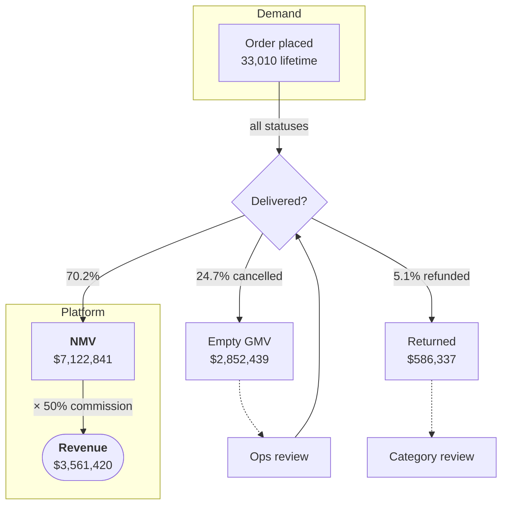
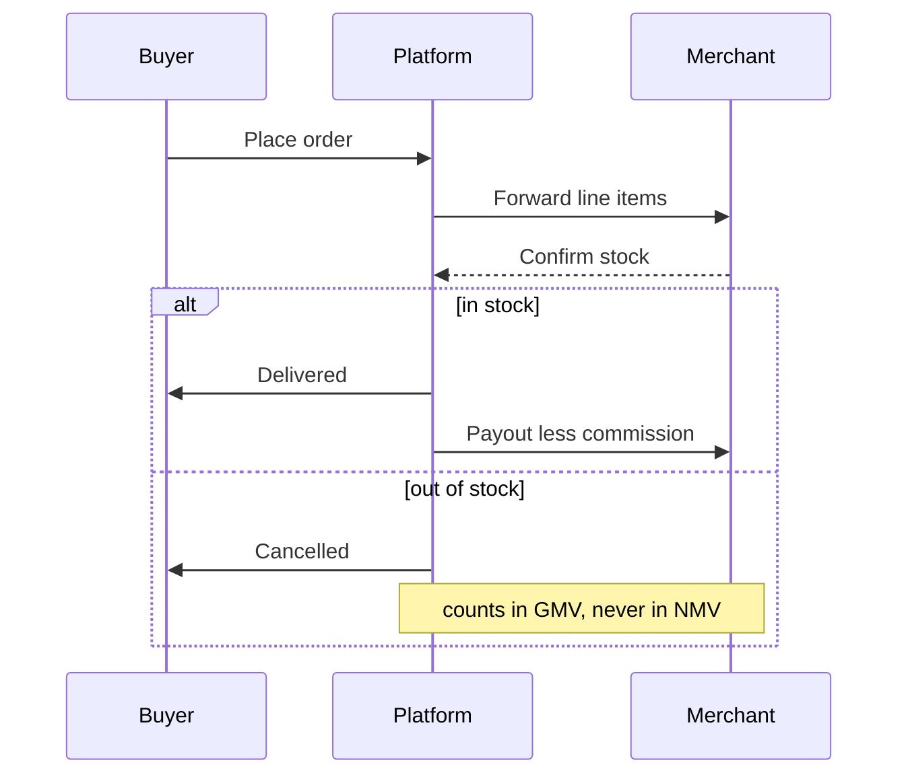

# YAML

`title` leaves the table and renders as the block heading above: 40/48, weight
500, tracking −0.02em. Everything else becomes a row.

**Exactly 7 rows show. The 8th onward collapse behind a toggle.**

```text
┌─────────────────────────────────────────────────┐
│ Markdown style reference — specimens   ← title  │  40/48, −0.02em
├─────────────────────────────────────────────────┤
│ 🏷  tags          (holistics)(bi)(aql)…          │  row 1  ┐
│ 👤 author        data-platform@holistics.io     │  row 2  │
│ ▦  updated       Aug 4, 2026                    │  row 3  │ always
│ ▤  status        published                      │  row 4  │ visible
│ #  page_count    1284                           │  row 5  │
│ ☑  peer_reviewed ☑                              │  row 6  │
│ 📄 related_model  📄 Renderer tokens             │  row 7  ┘
│ ⌄  14 more properties           ← toggle        │
└─────────────────────────────────────────────────┘
     ↑16px  ↑9.5rem label      ↑ value 13/20
     0.25px gap to label; 0.75rem column gap; 1rem row gap
```

The seven visible rows deliberately draw seven *different* marks — the block is
its own specimen. The remaining fourteen repeat those kinds with the harder
cases: a second date written `23 Dec 2026`, a timestamp keeping both halves, a
list of addresses, and the two `x-types` corrections.

`≤7 keys` → no toggle at all. `>7` → **"N more properties"** with a chevron-down;
expanded it reads **"Hide N properties"** with chevron-up.

## The icon comes from the value's kind, never the key's name

Renaming `review_due` to `reviewed_on` keeps the calendar. Only the *value*
decides: every rule below reads the value alone, so the same string types
identically under any key an author invents.

Three paths settle a row's mark — one value, a collection, or an authored
override. Within each, the first test that matches wins, and the order is the
design: it is where the ambiguous cases were decided.

### One value

Two tests run ahead of the rest, and read the value YAML *parsed* rather than the
text it was written as. That is what lets an author opt out by quoting.

| Test | Kind | Icon |
| --- | --- | --- |
| a real boolean, not the word `"true"` | boolean | ☑️ `check-square` |
| a real number, not a quoted `"1284"` | number | #️⃣ `hashtag` |

Everything else is read as a string, most specific first:

| # | Test | Kind | Icon |
| --- | --- | --- | --- |
| 1 | one `@`, no whitespace, domain ends in a dot plus 2+ letters | person | 👤 `user` |
| 2 | exactly `[Label](href)` — `href` carries no scheme | file | 📄 `file/document` |
| 2 | exactly `[Label](href)` — `href` is `http(s):`, or starts `//` | url | 🔗 `link` |
| 2 | exactly `[Label](href)` — any other scheme, `#`, `?`, or empty | text | 📝 `align-left` |
| 3 | `http://…` or `https://…` alone, with no space in it | url | 🔗 `link` |
| 4 | `2026-08-04`, `23 Dec 2026`, `Dec 23, 2026` | date | 📅 `calendar-cropped` |
| 5 | `09:30`, `14:30:05`, `2:30 pm`, `2026-08-04T14:30:00Z` | time | 🕘 `clock` |
| 6 | anything else | text | 📝 `align-left` |

The five shape tests, as they are written:

```text
email   /^[^\s@]+@[^\s@]+\.[a-z]{2,}$/i
link    /^\[[^\]]*\]\(([^)]*)\)$/       target then sorted by scheme
url     /^https?:\/\/\S+$/i
date    /^\d{4}-\d{2}-\d{2}$/
        /^(\d{1,2}\s+[a-z]{3,9}\.?\s+\d{4}|[a-z]{3,9}\.?\s+\d{1,2},?\s+\d{4})$/i
time    /^\d{1,2}:\d{2}(:\d{2})?(\s*[ap]\.?m\.?)?$/i
        /^\d{4}-\d{2}-\d{2}[T ]\d{2}:\d{2}(:\d{2})?(\.\d+)?(Z|[+-]\d{2}:?\d{2})?$/i
```

None of them validates, only recognises. `99:99` is a time and prints as
written; `2026-13-45` is a date and rolls through `Date.UTC` to **Feb 14, 2027**,
because a matched date is formatted rather than checked. The email test is
narrower than RFC 5322 on purpose — no quoted local part, no bracketed IP, and a
two-letter minimum on the last label, so `a@b.c` and `x@10.0.0.1` stay text.
Accepting them would draw a person mark beside a string no reader would recognise
as one. That same test also decides a list of addresses, and its local part is
where the printed name comes from.

Four of those positions carry a decision. An address is a **person** before it is
text, because an address in a document names someone. A **file** is checked
before a **url** because both are links and only the destination separates them —
`[Docs](https://…)` and a bare `https://…` are the same fact written two ways.
**Date** precedes **time** so a bare `2026-08-04` is a date, while a full
timestamp, which the date test does not match, falls through and keeps both
halves. And a bare name stays **text**: `author: Thang Do` draws no person mark,
because an address is the only evidence *in the value* that someone is named.

Row 2's third case is a link that is neither — `mailto:`, an anchor. It keeps the
text mark and still renders as a link in the value column.

### A list, or a map summarised by its keys

| # | Test | Kind | Icon |
| --- | --- | --- | --- |
| 1 | every item is a markdown link into the project | file | 📄 `file/document` |
| 2 | every item is an address | person | 👤 `user` |
| 3 | every item ≤32 chars, no whitespace, no inline markdown | chips | 🏷️ `tag` |
| 4 | anything else | lines | 📋 `list-ul` |

*Every* item, in all four: a mixed list is not a list of people, and one item
carrying a space turns the whole run out of pills. The mark belongs to the field,
never to the first value — `related_docs` naming four documents is one fact, and
repeating each item's own glyph 12px to the left would lie the moment two items
resolve to different types.

Watch `review_flags` against `tags` in the block above. Both are lists of
strings, but only one of them is *inferred*:

```text
🏷  tags          (holistics)(bi)(aql)      ← reserved key → always pills
☰  review_flags  needs review before…      ← inferred: spaces, >32 → lines
```

`tags` is lifted out before inference and pinned to chips, so a tag written
`needs review before publishing` still draws a pill — the test above never sees
it. Everything else does: past 32 characters a run of pills stops scanning as a
set of tags and starts wrapping mid-phrase, so the items go one per line instead.
Chips and lines are the one pair `x-types` cannot force — layout is read off the
values, not asserted.

### Forcing a kind with `x-types`

| Kind | How an author asks for it |
| --- | --- |
| boolean, date, file, number, person, text, time, url | by name |
| chips | as `tag`, and only on a list |
| lines | not forcible |

An override states meaning, not structure, so it cannot make a list render as one
scalar:

- `tag` on one value gives text — there is no such thing as a single pill
- `boolean` or `number` asked of a list falls back to chips-or-lines by the test above
- anything else on a list keeps the list's layout, and the row draws the mark asked for

It reaches inferred rows only — the reserved keys below are lifted out before
inference runs, so naming one here does nothing. And an entry naming a kind
absent from the table above is dropped just as quietly: a typo costs the
override, never the field.

### The rules that are not inference

These keys are lifted out before inference runs, and their marks are fixed:

| Key | Mark |
| --- | --- |
| `title` | not a row — it is the block's heading |
| `subtitle`, `version` | always text, whatever the value looks like |
| `tags` | always chips |
| `author`, `authors` | person only where an address was given, otherwise lines — labelled `author` for one, `authors` for more |
| `updated` | date |
| `x-types` | not a row — it is the override table, not a property |

`authors: [{name: Data Platform Team}]` is a team, and a person mark on it names
someone who does not exist. An address is the evidence that an individual is
meant, so a person is claimed only where one was given.

## When the value lies about the type

Two keys at the bottom of the block are shaped like one thing and mean another:
`contact: support@holistics.io` is email-shaped but names a mailbox, and
`build_number: 4821` is a number by shape but an identifier by meaning. Left
alone, the first draws a person mark and prints the mailbox as though it were
someone, with the derived name "Support" sitting in its tooltip.

```yaml
x-types:
  contact: text
  build_number: text
```

Listed keys take the named kind; everything unlisted still infers. The table
itself never renders as a row.

## Value treatments

```text
boolean      ☑            ← indicator, not an <input>; aria-label "true"
chips        (holistics) (bi) (aql)        ← HTag, theme gray
number       1284         ← as authored, no separators, tabular figures
date         Aug 4, 2026  ← 2026-08-04 and 23 Dec 2026 both print this way
time         09:30        ← 24-hour; seconds kept; a timestamp keeps its date
person       huy.vu@holistics.io           ← mailto:, name in title=, no avatar
file (ok)    📄 Renderer tokens            ← blue + type glyph
file (gone)  📄̶ This one is missing        ← grey + dashed underline
url          https://docs.holistics.io     ← as authored; blue, no glyph
```

---

# Heading

Type comes from HDS; the panel owns only the space. Weight 500 throughout.

```text
                        size/lead   colour     ↑before  ↓after
Display  ████████████   40/48       default       —       —
H1       ██████████     32/48       default     40px     8px
H2       ████████       24/36       default     32px    12px
H3       ██████         16/24       default     20px     8px
H4       █████          14/24       default     20px     8px
H5       █████          14/24       weak        12px     8px
H6       ████           13/20       weak        12px     4px
```

**H4 and H5 are the same 14/24** — they separate by colour alone. space-before
always exceeds space-after, so a heading binds to the content below it.

## H2 specimen

### H3 specimen

#### H4 specimen

##### H5 specimen — lighter

###### H6 specimen

## Inline code inside a heading

Chips scale with the heading: `max(13px, 0.875em)`.

```text
H1  32px →  Query the `gmv` metric          chip 28px  weight 500
H2  24px →  Query the `gmv` metric          chip 21px
H3  16px →  Query the `gmv` metric          chip 14px
H4  14px →  Query the `gmv` metric          chip 13px  ← floor hits
H5  14px →  Query the `gmv` metric          chip 13px  ← floor hits
H6  13px →  Query the `gmv` metric          chip 12px  ← own step
```

Live specimens — compare chip-to-text ratio:

# Query the `gmv` metric

## Query the `gmv` metric

### Query the `gmv` metric

#### Query the `gmv` metric

##### Query the `gmv` metric

###### Query the `gmv` metric

The floor matters at H4/H5, where `0.875em` = 12.25px would fall *below* the
prose chip. H6 overrides to `code-2xs` (12/16, weight 400) — at 13px the floor
would paint chip and heading identically. H1 chips take weight 500 to match.
All heading chips lift 0.065em to centre caps.

# H1 with paragraph
Every depth keeps the step it would have had in the body. H1 sets 32/48, so a
quote grows to hold it.

## H2 with paragraph
24/36, the same as an H2 in the document — quoting a passage changes who is speaking, not the outline the passage carries.

### H3 with paragraph
16/24, one step above this 14px sentence.

#### H4 with paragraph
14/24 — the first depth that matches the quote's own prose in size, separating from it by weight alone.

##### H5 with paragraph
14/24 in gray-600. Same size as H4: colour is what separates the two, here and in the body alike.

###### H6 with paragraph
13/20 in gray-600, the smallest step.

---

# Body

## Paragraph

14/24, weight 400, `text-default`. No paragraph token — reads the generic 12px
`block-space-before`, shared with rules and HTML blocks. **No space-after:** the
gap comes from the next block's space-before, so consecutive paragraphs do not
double up.

## File link — all four states

```text
① resolved      📄 Renderer tokens
                blue-600 text · blue-600 glyph · 2px gap · underline on hover

② missing       📄̶ This one is missing
                gray-700 text · gray-600 glyph · dashed 0.5px underline standing
                renders as <span>, cursor: default — not navigable

③ unsupported   ⚠ mailto:someone@example.com
                broken colours, own glyph

④ wrapped       📄 A reference with a very long name that
                   ↳ runs onto a second line and clears the glyph
                continuation indents past the icon, never under it
```

The glyph is keyed on the *compound* suffix, not the last extension — every AML
file ends `.aml`, so the segment before it is what names the entity:

```text
orders.model.aml        data-model     model cube
sales.dataset.aml       data-set       dataset stack
revenue.page.aml        canvas-light   canvas page
*.aml (bare)            data-model     fallback
metrics-glossary.md     file/document  plain document
query.sql               sql
unresolved              (broken-link icon token, set in the panel)
```

Each entity type carries its own glyph, so the reference says *what* it points at
before it is read: [orders model](../models/orders.model.aml) takes the model
cube, [sales dataset](../datasets/sales.dataset.aml) the dataset stack,
[revenue overview](../pages/revenue-overview.page.aml) the canvas page, and
[metrics glossary](../docs/metrics-glossary.md) the plain document.

The other two states, for contrast: [revenue model](../models/revenue.model.aml)
is missing — grey, dashed, not navigable — and
[a very long reference name that will wrap onto a second line to show continuation indent](../models/orders.model.aml)
wraps.

The dashed underline exists because a missing link has `cursor: default` — with
no pointer change, it is the only thing advertising the hover preview. Dashed so
it does not read as a link; 0.5px so it stays quieter than a strikethrough's 1px.

## Inline code — one line to many

13/20 mono, weight 500, red-600, gray-50 fill, 1px gray-300 border, 6px radius,
4px padding-x. Height is 20px; vertical padding is derived, never set.

```text
1 line    the metric `cancelled_value_ratio` is the one to watch
          ┌──────────────────────┐
          │ cancelled_value_ratio │   chip sits on the line, 20px tall
          └──────────────────────┘

2 lines   … a chip whose name is long enough that the line breaks
          ┌────────────┐
          │ SELECT stat │ ← border closes at the break
          └────────────┘
          ┌──────────┐
          │ us, COUNT │ ← and reopens on the next line
          └──────────┘
          box-decoration-break: clone → each fragment keeps radius + border
```

A chip is an inline box, so a long one **breaks across lines** and each fragment
paints its own border and radius rather than one box stretched around the wrap.
Specimens:

One line: the metric `cancelled_value_ratio` is the one to watch.

Two lines: the fully qualified name `ecommerce_orders.cancelled_value_ratio_by_merchant_and_month` breaks mid-chip.

Three lines: `SELECT merchant_id, status, COUNT(*) AS orders, SUM(gmv) AS gross FROM ecommerce_orders WHERE status IN ('cancelled','refunded') GROUP BY 1, 2 ORDER BY 3 DESC` runs on.

Chips lift 0.05em. In a table cell they take `code-xs`; colour, border and radius
stay shared.

## Strikethrough

1px at 50% opacity, `color-mix` on `currentColor` — so it inherits the colour of
whatever it strikes:

```text
plain     ~~struck text~~        → near-black rule
code      ~~`struck_code`~~      → red rule
link      ~~[struck link](…)~~   → blue rule
heading   ~~struck~~ in an H2    → rule at heading colour and size
```

~~Plain struck text~~ · ~~`struck_code`~~ · ~~[struck link](/components/markdown/renderer.vue)~~

---

# List

Shared rhythm: 12px before, 16px after, 8px between items. Indent and marker gap
fork per type.

```text
                indent  nested  marker gap  reserve
bulleted         16px    +24px     5px       7px
numbered          4px    +24px     6px      17px
checklist         2px     +0px     8px      16px (the control)
```

## Why numbered indents 4px, not 16px

```text
reserve ─┐
      ▪  Bulleted item          ← 7px reserve  + 16px indent = text at 23px
   1.    Numbered item          ← 17px reserve +  4px indent = text at 21px
   ☐     Checklist item         ← control is the marker, no column to clear
```

The numeral advances 17px against a bullet's 7px. The smaller indent cancels the
wider advance so both lists start text at the same place. That 17px is measured
from the font, not chosen — it never reaches the panel.

## Numeral width: what happens past 2 digits

The 17px reserve fits **two digits**. It does not cap or reformat — a 3-digit
numeral keeps counting and paints *leftward* past the list's edge. Text never
moves.

The column the numeral gets is 23px: the list's 17px reserve plus the item's 6px
marker gap. Measured against it at 14px Inter, `99.` is the last marker that
fits, and only just:

```text
   9.    12.36px   fits, 10.64px spare
  10.    18.20px   fits,  4.80px spare
  99.    21.04px   fits,  1.96px spare   ← last one inside the column
 100.    27.04px   overhangs by  4.04px
1000.    35.87px   overhangs by 12.87px
```

99 is therefore the practical ceiling, but nothing enforces it: past it the item
stays a `list-item` and keeps its number — the marker just hangs into the left
margin. A numbered list that will pass 99 wants a wider reserve, not a cap.

```text
   1.  text          ← text edge 378px
  99.  text          ← text edge 378px   reserve exactly filled
 100.  text          ← text edge 378px   numeral overflows left, text holds
1000.  text          ← text edge 378px   overflows further left
       ↑ every text edge identical; only the numeral grows outward
```

Specimen — starts at 98 so you can watch it cross:

98. Two digits, inside the reserve.
99. Still two digits.
100. Three digits. The numeral now starts left of where 99 did; this text has not moved.
101. Confirms it holds.

## Nesting — every combination

Markers cycle by depth within a type, and a switch of type resets to that type's
own marker.

```text
bulleted → bulleted        numbered → numbered       mixed
▪ level 1                  1. level 1                1. numbered
  ▫ level 2                  1. level 2                 ▪ bulleted inside
    ▪ level 3                  1. level 3                 ☐ checklist inside
                                                     ▪ bulleted
                                                       1. numbered inside
                                                         ☑ checklist inside
```

Bulleted inside bulleted:

- Level 1
  - Level 2
    - Level 3

Numbered inside numbered:

1. Level 1
   1. Level 2
      1. Level 3

Numbered → bulleted → checklist:

1. Numbered parent
   - Bulleted child
     - [ ] Checklist grandchild
     - [x] Done grandchild

Bulleted → numbered → checklist:

- Bulleted parent
  1. Numbered child
     - [x] Checklist grandchild

Checklist → bulleted → numbered:

- [x] Checklist parent
  - Bulleted child
    1. Numbered grandchild

Checklist nested in checklist (nested indent is 0, so depth reads by the control alone):

- [x] Parent task
  - [ ] Child task
    - [x] Grandchild task

## Checklist states

```text
☐  open item          text at full colour
☑  done item          text struck at 50%, chips at 70% opacity
☑  done with `chip`   ~~struck~~ + chip fades as an object
```

- [ ] Open item with a `chip` at full strength
- [x] Done item — text struck, and this `chip` drops to 70%
- [ ] Item whose text is long enough to wrap onto a second line, so you can see that the continuation aligns to the text column and not back under the control

## Code inside an item

6px before / 12px after, against a top-level fence's 12px / 24px.

- Item introducing a fence:

  ```sql
  SELECT status, COUNT(*) FROM orders GROUP BY 1
  ```

- The tighter gap is because a fence inside an item is subordinate to its
  sentence, where a top-level fence is a peer of its neighbours. A fence that
  ends an item takes over the gap below it and the item gives up its own 8px.

---

# Blocks

## Blockquote

14/24 gray-800 — body copy's own step, marked as quoted by rule and inset rather
than by size. Headings inside keep their document steps, H1 through H6. 4px
green-600 rule as a `::before` (so it can carry its own radius), 20px text gap,
20px padding-right, 0 vertical padding, 12px before / 16px after.

```text
┃ Plain quote at 14/24, gray-800.
┃
┃ ## A heading inside a quote
┃ Headings keep their own size and spacing tokens — an H2 here is still
┃ 24/36 with 32px above it, so it outsizes the quote's own 14px text.
┃
┃ ▪ list items keep list rhythm: 8px apart
┃ ▪ and the list's own 12px/16px outer spacing
┃
┃ `chips` scale in em → 14px base, matching the prose around them
↑
4px rule, radius on inner edge; outer ends clipped to the fill's corner
```

Specimens:

> Plain quote. Sets 14/24 in gray-800, matching the body copy around it in size
> — the rule and inset mark it as quoted, not a type step.

> # Heading inside a quote
>
> Every depth keeps the step it would have had in the body. H1 sets 32/48, so a
> quote grows to hold it.
>
> ## H2 inside a quote
>
> 24/36, the same as an H2 in the document — quoting a passage changes who is
> speaking, not the outline the passage carries.
>
> ### H3 inside a quote
>
> 16/24, one step above this 14px sentence.
>
> #### H4 inside a quote
>
> 14/24 — the first depth that matches the quote's own prose in size, separating
> from it by weight alone.
>
> ##### H5 inside a quote
>
> 14/24 in gray-600. Same size as H4: colour is what separates the two, here and
> in the body alike.
>
> ###### H6 inside a quote
>
> 13/20 in gray-600, the smallest step.

> Paragraph directly above a list.
>
> - First item
> - Second item
> - Third item
>
> Paragraph directly below it. The list keeps its own 12px before / 16px after
> and 8px between items, so the gaps around it are the list's, not the quote's.

> - [x] Checklists work inside quotes
> - [ ] Controls stay 16px square
>
> 1. So do numbered lists
> 2. With their own 17px reserve

> ⚠️ A quote holds `inline code`, [links](/components/markdown/renderer.vue),
> **bold** and ~~strikes~~ — each reads at the quote's 14px, since chips scale in
> `em` of their context.

Nesting depth and heading depth are independent axes. A quote indents by the full
box each time, to any depth, while the heading scale inside it stays put — so the
inset says how deeply the passage is quoted and the type says how the passage is
structured. Set side by side, the same six steps appear at both levels:

> # H1 at the first level
>
> ## H2 at the first level
>
> ### H3 at the first level
>
> #### H4 at the first level
>
> ##### H5 at the first level
>
> ###### H6 at the first level
>
> > # H1 at the second level
> >
> > ## H2 at the second level
> >
> > ### H3 at the second level
> >
> > #### H4 at the second level
> >
> > ##### H5 at the second level
> >
> > ###### H6 at the second level

Read across the two boxes: each depth holds its step, its weight and its colour.
Only the left inset moved.

Carried further, the type never tracks the nesting. The same H2 at three levels:

> ## H2 at the first level
>
> > ## H2 at the second level
> >
> > > ## H2 at the third level
> > >
> > > All three set 24/36 — a heading five quotes deep would too. Letting depth
> > > shift the step would encode two different things on one axis.

Indentation itself keeps accumulating past the point where headings are useful:

> Nested quotes indent by the full box each time, to any depth:
>
> > Second level.
> >
> > > Third level.
> > >
> > > > Fourth level, still indenting.

## Code block

Fill gray-100 `!important` (HCodeBlock writes Shiki's background inline, which a
stylesheet cannot otherwise beat), 12px radius, 24px padding both axes, border
0 width. 12px before / 24px after — asymmetric because a fence answers the
sentence above it and opens a gap before the next.

```typescript
const KIND_ICONS: Record<FrontmatterFieldKind, IconName> = {
  boolean: 'check-square',
  date: 'calendar-cropped',
  person: 'user',
}
```

A line long enough to scroll rather than wrap:

```sql
SELECT merchant_id, status, COUNT(*) AS orders, SUM(gmv) AS gross_value, SUM(nmv) AS net_value, AVG(delivery_attempts) AS avg_attempts FROM ecommerce_orders WHERE status IN ('cancelled', 'refunded') GROUP BY 1, 2 ORDER BY 3 DESC
```

## Table

Header and body cells share one box: 8px padding-y, 12px right, 8px left. 8px
radius, 16px before / 24px after.

```text
        type          weight  fill
header  title-sm      500     gray-50    ← weight comes from the step, not pinned
cell    body-sm       400     —
chip    code-xs       500     gray-50    ← one deviation from the prose chip
```

Every content type, and how each behaves in a cell:

| Content | Specimen | Behaviour |
| --- | --- | --- |
| Plain | 33,010 orders | 13/20, wraps at the cell |
| Chip, short | `gmv` | sits inline, 13/20 |
| Chip, wraps | `ecommerce_orders.cancelled_value_ratio_by_merchant` | breaks mid-chip, each fragment keeps its border |
| Chip, 3 lines | `SELECT merchant_id, status, COUNT(*) AS orders, SUM(gmv) FROM ecommerce_orders WHERE status = 'cancelled' GROUP BY 1, 2` | keeps breaking; row grows |
| Link, fits | [Renderer](/components/markdown/renderer.vue) | glyph + label on one line |
| Link, wraps | [A reference whose name is long enough to run past the column and onto a second line](/components/markdown/renderer.vue) | continuation clears the glyph |
| Link, broken | [Missing file](/2.%20Serious/nope.md) | grey + dashed underline |
| Struck | ~~deprecated~~ | rule at cell colour |
| Mixed | ~~`old_metric`~~ → `new_metric` | each keeps its own treatment |

**Narrow table — no scroll, no shade:**

| Metric | Value |
| --- | --- |
| GMV | $11,581,542 |
| NMV | $7,122,841 |

**Tables rarely scroll, and that is the point.** The `table` is its own scroll
container, and cell content wraps — long chips break across lines, long labels
wrap, so columns compress to fit rather than pushing the table wider. Neither
column count nor long values overflows on their own: the two tables below hold
100-character chips and still fit.

Overflow needs content that genuinely cannot break — many columns each carrying
an unbreakable token at once. When that happens the shade appears; short of it,
the table simply gets denser.

| Query | Owner | Result |
| --- | --- | --- |
| `SELECT merchant_id, status, COUNT(*) AS orders FROM ecommerce_orders WHERE status = 'cancelled' GROUP BY 1, 2` | `data-platform@holistics.io` | `24.7%` |
| `SELECT category_id, SUM(gmv) AS gross, SUM(nmv) AS net FROM ecommerce_order_items GROUP BY 1 ORDER BY 2 DESC` | `category-team@holistics.io` | `$2,301,275` |

```text
not clipped        ┌────────────────────────────┐
                   │ Query   │ Owner  │ Result  │   no shade, no tab stop
                   └────────────────────────────┘

clipped, at rest   ┌────────────────────────────┐
                   │ Query   │ Owner  │ Resul │▒│   right shade only
                   └────────────────────────────┘

clipped, mid       ┌────────────────────────────┐
                   │▒│ uery  │ Owner  │ Resul │▒│   both shades
                   └────���───────────────────────┘

clipped, at end    ┌────────────────────────────┐
                   │▒│ ery   │ Owner  │ Result  │   left shade only
                   └────────────────────────────┘
                     ↑ 24px wide, 10% gray-900, 150ms fade
```

Each edge is independent, written as `data-clipped-start` / `data-clipped-end`.
The table takes `tabindex="0"` **only while clipped**, so a scrollable table is
keyboard-reachable and a fitting one is not a tab stop.

The shades are pseudo-elements with no `z-index` — an absolutely positioned
element already paints above the cells, and staying out of the stacking order
lets a file link's hover preview paint over the shade, which is the right way
round.

Width and strength of that shade are editable; its colour is not — a shade with a
hue reads as a fill rather than as depth. There is no table text-colour field for
the same reason: a table's text is the page's text.

## Mermaid

12px before / 32px after. Labels pinned to `body-sm`, node radius 6px, polygon
radius 6px, 3px connector gap painted as a halo in the surface colour, edge
labels on an opaque white chip.

**Hover any diagram to reveal its expand control; click to open the lightbox.**
The lightbox is an `HModal` teleported to `<body>`, which is why the diagram
tokens are declared at `:root` — on the renderer they would be unset by the time
it paints, squaring every node and closing the halo, so the expanded drawing
would differ from the one that was clicked.

```text
┌──────────────────────────────┐
│  diagram                 [⤢] │  ← control appears on hover
│                              │
│   (Merchants) ──▶ (Platform) │
└──────────────────────────────┘
        click → full-screen lightbox, same tokens, artwork scales
```

A flowchart with branching, a decision diamond (sharp — polygons need their
outline redrawn to curve), subgraphs, and edge labels over connectors:



A sequence diagram — participants are rects, so they take the same 6px radius a
flowchart node does, rather than mermaid's own 3px:



## Horizontal rule

1px solid gray-300, 16px above.

---

Below a rule the gap is 12px, not 16px — a rule has no space-after token, so the
next block falls back to `block-space-before`.
